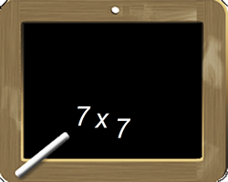
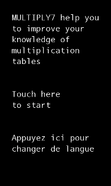
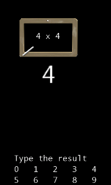
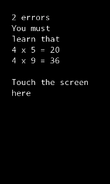

**This program will help you to learn multiplication tables. It demonstrates how to program :**
* Audio
	* SoundEffect.Play
* Moving sprites
	* Texture2D, SpriteBatch.Begin, SpriteBatch.Draw, SpriteBatch.End
* Touch screen management
	* TouchPanel.ReadGesture
* Strings localization for i18n with resx
	* ResourceManager.GetString
* etc.
    